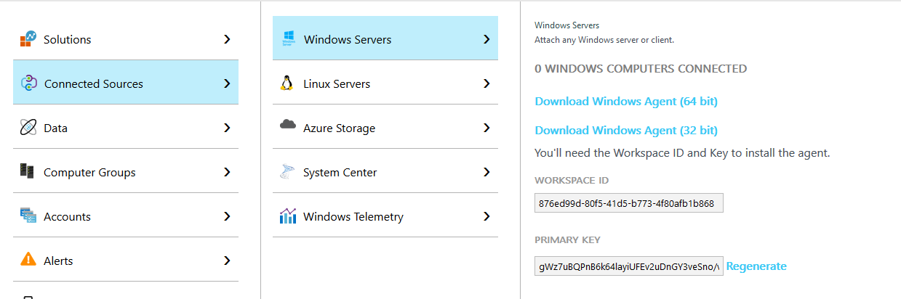

# Auth0 Log extension for Azure Log Analytics

This extension will take all of your Auth0 logs and export them to Azure Log Analytics.

## Configure Azure Log Analytics

First you'll need a Log Analytics account which you can create for free in your [Azure Portal](https://portal.azure.com/#create/Microsoft.LogAnalyticsOMS).

Once your service is up, you will need the **Workspace Id** and **Workspace Key**, this can be obtained in your OMS Portal > Settings > Connected Services:



## Configure Webtask

If you haven't configured Webtask on your machine run this first:

```
npm i -g wt-cli
wt init
```

> Requires at least node 0.10.40 - if you're running multiple version of node make sure to load the right version, e.g. "nvm use 0.10.40"

## Deploy to Webtask.io

To run it on a schedule (run every 5 minutes for example):

```
wt cron schedule \
    --name auth0-logs-to-log-analytics \
    --secret AUTH0_DOMAIN="YOUR_AUTH0_DOMAIN" \
    --secret AUTH0_CLIENT_ID="YOUR_AUTH0_CLIENT_ID" \
    --secret AUTH0_CLIENT_SECRET="YOUR_AUTH0_CLIENT_SECRET" \
    --secret LOGANALYTICS_WORKSPACEID="YOUR_LOGANALYTICS_WORKSPACE_ID" \
    --secret LOGANALYTICS_WORKSPACEKEY="YOUR_LOGANALYTICS_WORKSPACE_KEY" \
    --secret LOGANALYTICS_NAMESPACE="NAME_FOR_YOUR_LOG_TYPE" \
    "*/5 * * * *" \
    ./build/bundle.js
```

> You can get your Client Id/Secret creating a Non-Interactive App and granting it a permission to `read:logs` as instructed here: https://auth0.com/docs/api-auth/config/using-the-auth0-dashboard

## Usage

Now go to the [Azure Portal](https://portal.azure.com/) and in your Log Analytics service use the Log Search feature to view your logs and filter them.

## Issue Reporting

If you have found a bug or if you have a feature request, please report them at this repository issues section.
